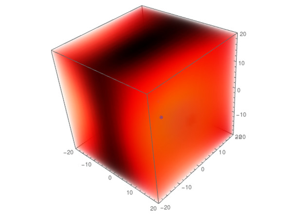

# Beamforming Array Simulator
Beamforming microphone arrays can spatially filter sound to remove background noise and isolate sound coming from a focus point. This Mathematica code is my attempt to simulate the rejection pattern of an arbitrary beamforming microphone array in three-dimensional space. I developed this while working for Shell TechWorks during the summer of 2018.

There are three files here to facilitate development and understanding, but only `beamformingSimulator.nb` runs the full 3D simulation.

##### How it Works:
- Calculate the distances between the intended focus point and each of the microphones and convert these distances to time delays
- Generate a sine wave at the test frequency at each point in space
- For each point, vary the test signal phase to maximize the sum of the amplitudes measured at each mic
  - This can be most easily visualized and understood by running `manipulateMax.nb`, which simulates an arbitrary 1D array with the source placed axially
  - For points near the focus, this amplitude will be high. For points outside of the focus, this amplitude will be low for highly selective arrays (the goal)
  - Basically, high frequencies and large arrays work better than low frequencies and small arrays
- The frequency response of an arbitrary 1D array with the source placed axially can be visualized with `freqResponse.nb`

Because the simulation relies heavily on `Maximize`, it runs very slowly. Be warned.

##### Example 3D gain pattern output:

##### How to run:
- Open `beamformingSimulator.nb`
- Input your focus point and array coordinates (in cm) as desired. You can enter each point, enter half the array and mirror it, or enter a radius, number of elements, and array angle, just uncomment what you need. Make sure the range values (array `r`) will show your full array and the area you're interested in.
- Run pre-evaluation cell and sanity check output
- Enter desired test frequency
- Run heavy evaluation cell. It will beep when finished evaluating the 2D model, which should be pretty quick, so you can stop it at that point and see vaguely what it looks like in 2D by running the plotting cell. It will beep again in a few minutes when it's finished the 3D evaluation.
- Run the plotting cell. The array appears as blue dots and the focus point appears as a green dot. In the 2D model, the green bar at the bottom shows the test frequency wavelength compared to the array size. In the 3D model, the `Manipulate` allows you to slice the view to see inside. I'm sure there's a better way to do this, but the default `OpacityFunction` seemed misleading. I'd like to have the `ClipPlanes` ignore `mics3D` and `focusPoint3D`, but I couldn't figure out how to do that. You can play with the plotting cell without reevaluating the whole thing.

###### Disclaimers:
I'm by no means an expert on either beamforming or Mathematica, so if I've made any grave errors in either respect, please let me know. I currently have no way to validate the simulation. Note that all gain scales are linear (not in decibels).
